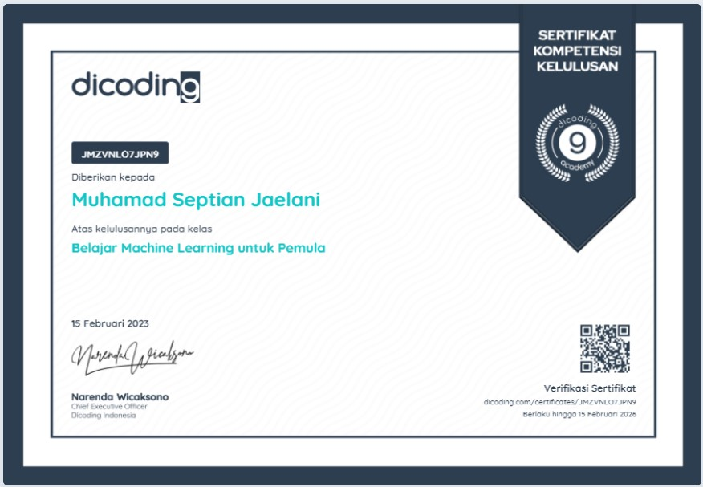
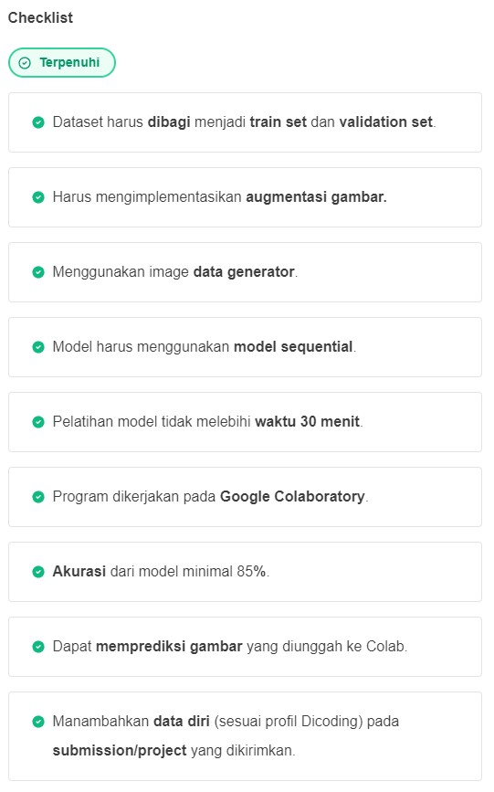

# Kelas Dicoding Belajar Machine Learning untuk Pemula

  

Submisi ini mendapatkan nilai 5 bintang dikarenakan memiliki nilai akurasi **lebih dari 96%** pada proses training dan 98% pada proses validasi. Selain itu, pada submisi ini saya menggunakan beberapa teknik lain yaitu:

- Penggunaan Dropout pada hidden layer
- Penggunaan Callback untuk memberhentikan proses training disaat memenuhi ketentuan akurasi diatas 96%
- Menampilkan visualisasi hasil dari model

Submisi untuk Tugas Akhir Kelas Dicoding.  
Tugas ini membuat sebuah Model untuk mendeteksi  
permainan gunting, batu, dan kertas.

## Data

Data yang digunakan pada model dapat dilihat [disini](https://github.com/dicodingacademy/assets/releases/download/release/rockpaperscissors.zip)

## Model

Model ini menggunakan metode CNN dalam pembuatannya

## Hasil

Hasil dari model ini kurang memuaskan dikarenakan dapat mendeteksi dengan benar jika gambar input memiliki background hijau dan jika gambar input tidak memiliki background hijau, model susah mendeteksi bentuk tangan.  
Hal ini dikarenakan dataset yang kurang bagus, dimana seluruh dataset memiliki background berwarna hijau mengakibatkan model hanya bisa mendeteksi bentuk tangan dengan background hijau.

  

  

